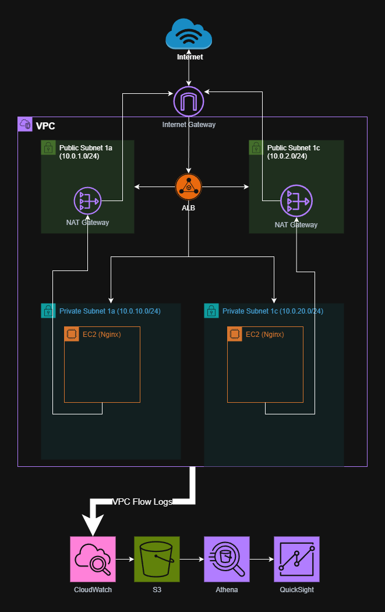

# AWS Network Visibility Dashboard

**ステータス**: 🚧 開発中（2025年11月〜 Week 0-2: EC2/ALB完了、進捗率40%）

## 👤 About / このプロジェクトについて

### プロジェクトの目的

ネットワーク監視業務の経験から、AWSインフラのトラフィック可視化の重要性を実感。
本プロジェクトでは、VPC Flow Logsを活用した自動化ツールを構築することで、
以下のスキルの実証と実践を目指す：

- AWSネットワーク設計・構築スキル
- Terraform/IaCによるインフラコード化
- セキュリティ監視の自動化とコスト最適化

### なぜこの技術スタックか

- **VPC Flow Logs**: AWSネットワーク監視の標準的なアプローチ
- **Athena**: S3データを直接SQLクエリ可能（サーバーレス、コスト効率的）
- **QuickSight**: AWS統合が容易で、リアルタイムダッシュボード構築に最適
- **Terraform**: 再現性の高いインフラ管理、GitOpsワークフローの実践

## 📋 プロジェクト概要

AWS VPC Flow LogsとAthena、QuickSightを活用したネットワーク監視・可視化ダッシュボード。
ネットワークトラフィックの可視化、異常検知、Security Group分析を自動化し、
AWSインフラの運用効率を向上させるツールを目指す。

### アーキテクチャ図



**構成概要**:
- **VPC**: 10.0.0.0/16（Public/Private Subnet × 2 AZ）
- **ALB**: Internet-facing、Public Subnetに配置
- **EC2**: Nginx Webサーバー、Public Subnet配置
- **監視**: VPC Flow Logs → S3 → Athena → QuickSight（実装予定）

## 🛠 技術スタック（予定）

### 監視対象（幅広さ）
- **VPC**: Virtual Private Cloud, Subnets, Route Tables, NAT Gateway
- **EC2**: Webサーバー（Nginx）
- **ALB**: Application Load Balancer
- **RDS**: (オプション、予算次第で省略可)

### 監視基盤（専門性）
- **VPC Flow Logs**: トラフィック収集
- **S3**: ログ保存
- **Athena**: ログ分析（SQLクエリ）
- **QuickSight**: 可視化ダッシュボード
- **CloudWatch**: アラート・監視
- **Lambda**: ログ分析自動化（Python）

### IaC
- **Terraform**: 全インフラのコード化

## 🎯 実装予定機能

### フェーズ1: Webアプリケーション環境構築
- [x] VPC/サブネット/ルートテーブル構築
- [x] EC2インスタンス構築（Nginx Webサーバー）
- [x] ALB（Application Load Balancer）構築
- [x] セキュリティグループ設計

### フェーズ2: 監視基盤構築
- [ ] VPC Flow LogsのS3保存設定
- [ ] Athenaクエリ環境構築（トラフィック分析）
- [ ] Lambda関数によるログ分析自動化

### フェーズ3: 可視化・アラート
- [ ] QuickSightダッシュボードでのトラフィック可視化
- [ ] 異常トラフィック検知とCloudWatch Alarms連携
- [ ] Security Group設定の可視化と不要ルール検出

## 📅 開発スケジュール

- **準備期間**: 2025年11月〜12月（基盤整備・技術検証）
- **開発期間**: 2026年1月〜2月（実装・テスト）
- **目標**: 2026年2月末までに完成

## 📁 プロジェクト構成（予定）

```
aws-network-visibility-dashboard/
├── terraform/
│   ├── modules/
│   │   ├── vpc/                # VPC, Subnets, Route Tables, IGW
│   │   ├── security_groups/    # ALB/EC2 Security Groups
│   │   ├── ec2/                # EC2 instances (Nginx)
│   │   ├── alb/                # Application Load Balancer
│   │   └── monitoring/         # VPC Flow Logs, S3, Athena（予定）
│   └── environments/
│       └── dev/                # 開発環境設定
├── lambda/                     # Lambda関数（Python）（予定）
├── docs/                       # ドキュメント・アーキテクチャ図
└── README.md
```

## 🏗 Infrastructure Setup

### VPC Configuration
- **VPC CIDR**: 10.0.0.0/16
- **Region**: ap-northeast-1
- **VPC ID**: vpc-03929123dcf05e7f3

### Subnets

**Public Subnets**
- public-subnet-1a: 10.0.1.0/24 (ap-northeast-1a) - `subnet-005db386efbbfd330`
- public-subnet-1c: 10.0.2.0/24 (ap-northeast-1c) - `subnet-0aeacf40c0c9d2d85`

**Private Subnets**
- private-subnet-1a: 10.0.11.0/24 (ap-northeast-1a) - `subnet-0d7d4720b9812e99c`
- private-subnet-1c: 10.0.12.0/24 (ap-northeast-1c) - `subnet-098e32e7cd909e16f`

### Network Components
- **Internet Gateway**: igw-066491c60ab43148a (Attached to VPC)
- **Route Table**: rtb-0759b8e7719c2006e (Public subnets route to IGW)

### Security Groups

**ALB Security Group**
- HTTP (80): 0.0.0.0/0 → ALB
- HTTPS (443): 0.0.0.0/0 → ALB

**EC2 Security Group**
- HTTP (80): ALB Security Group → EC2

### Compute Resources

**EC2 Instance**
- **Instance ID**: i-094577d7ad08e3cdb
- **AMI**: Amazon Linux 2023 (latest)
- **Instance Type**: t2.micro
- **Public IP**: 18.176.53.67
- **Subnet**: public-subnet-1a (10.0.1.0/24)
- **Web Server**: Nginx (auto-configured via user data)
- **Status**: Running, serving test HTML page

**Application Load Balancer**
- **DNS Name**: network-visibility-dev-alb-596729362.ap-northeast-1.elb.amazonaws.com
- **Scheme**: Internet-facing
- **Subnets**: public-subnet-1a, public-subnet-1c
- **Target Group**: EC2 instance (i-094577d7ad08e3cdb)
- **Health Check**: HTTP:80 / (healthy)
- **Access Logs**: Enabled (S3: network-visibility-alb-logs-dev-ap-northeast-1)

## 🚀 Getting Started

### Prerequisites
- Terraform >= 1.0
- AWS CLI configured
- AWS Account with appropriate permissions

### Deployment

```bash
cd terraform/environments/dev
terraform init
terraform plan
terraform apply
```

### Verify Deployment

```bash
# VPC確認
aws ec2 describe-vpcs --filters "Name=tag:Name,Values=network-visibility-vpc-dev" --output table

# Subnet確認
aws ec2 describe-subnets --filters "Name=tag:Project,Values=network-visibility" --output table

# EC2インスタンス確認
aws ec2 describe-instances --instance-ids i-094577d7ad08e3cdb --output table

# ALB確認
aws elbv2 describe-load-balancers --names network-visibility-dev-alb --output table

# ALBターゲットヘルスチェック確認
aws elbv2 describe-target-health --target-group-arn <target-group-arn>

# Webアクセステスト（ALB経由）
curl http://network-visibility-dev-alb-596729362.ap-northeast-1.elb.amazonaws.com
```

## 📚 参考資料

- [AWS VPC Flow Logs Documentation](https://docs.aws.amazon.com/vpc/latest/userguide/flow-logs.html)
- [AWS Athena Documentation](https://docs.aws.amazon.com/athena/)
- [AWS QuickSight Documentation](https://docs.aws.amazon.com/quicksight/)

---

**Last Updated**: 2025-11-17 (Week 0-2: EC2/ALB構築完了)
